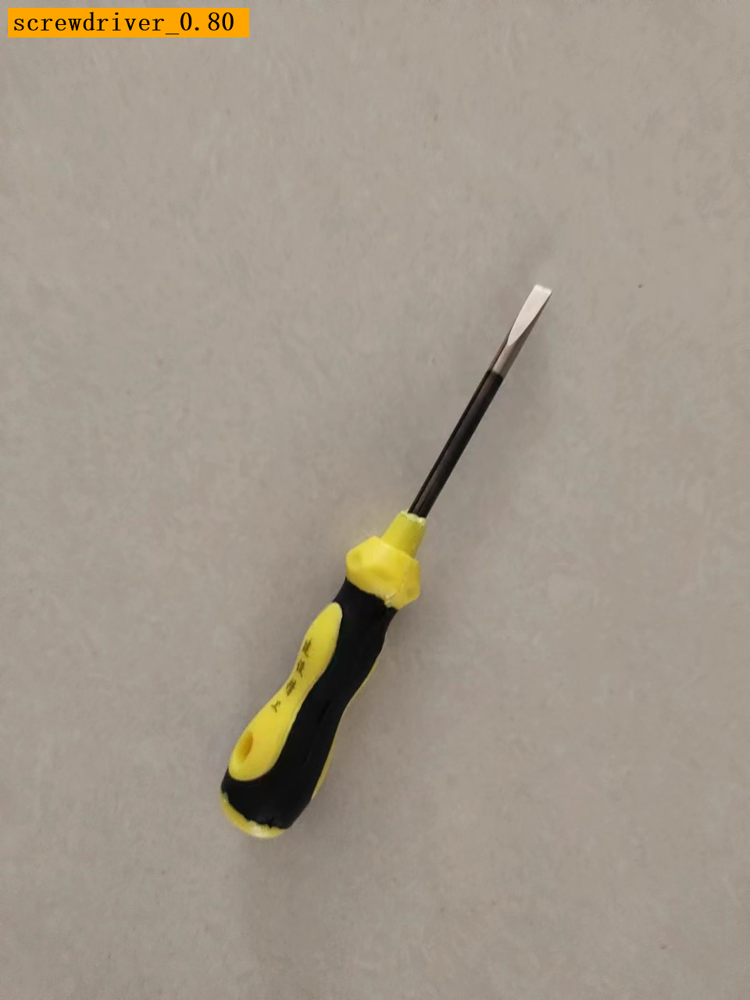
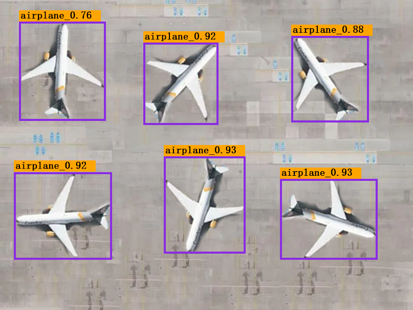
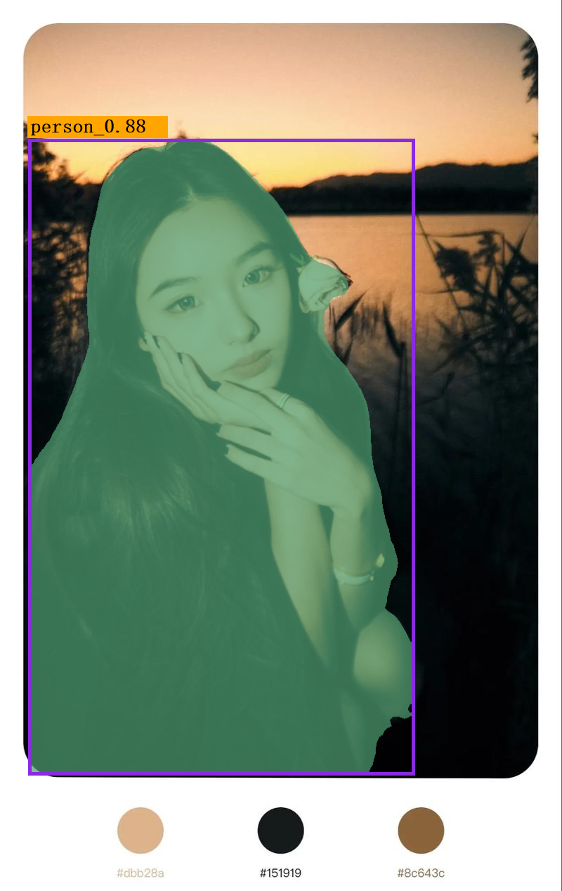
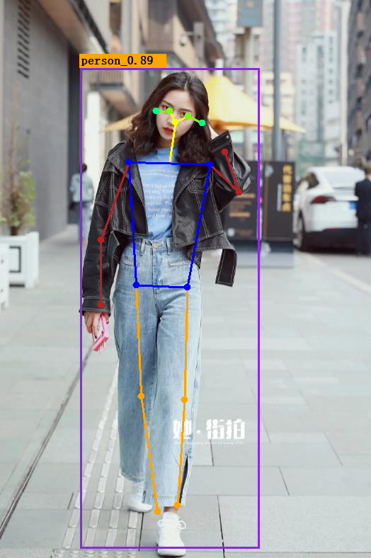
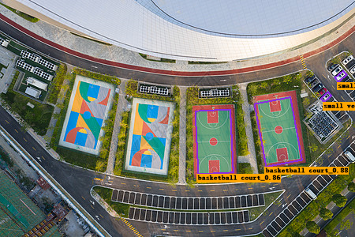

# Yolo.Net

本项目集成封装了Yolo各种推理模型，包括且不限于Cls、Seg、Obb、Pose

支持Cpu、Gpu，免Cuda

**注意: 目前只支持YoloV8**

## 效果

cls



Detection



Seg



Pose



OBB



## 安装

```
dotnet add package CanCanNeedJJBong.Yolo --version 1.0.0
```

## 用法

封装YoloService，参考TestConsole项目
